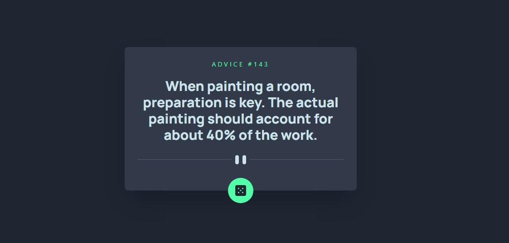
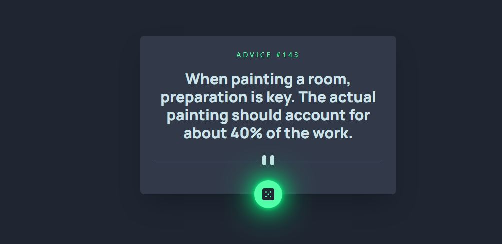
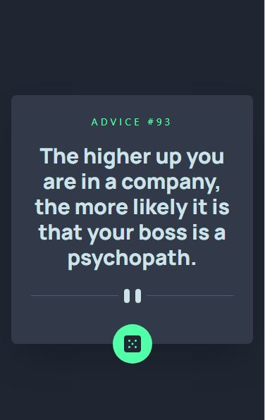

# Frontend Mentor - Advice generator app solution

This is a solution to the [Advice generator app challenge on Frontend Mentor](https://www.frontendmentor.io/challenges/advice-generator-app-QdUG-13db). Frontend Mentor challenges help you improve your coding skills by building realistic projects.

## Table of contents

- [Frontend Mentor - Advice generator app solution](#frontend-mentor---advice-generator-app-solution)
  - [Table of contents](#table-of-contents)
  - [Overview](#overview)
    - [The challenge](#the-challenge)
    - [System Requirements](#system-requirements)
    - [How to use](#how-to-use)
    - [Screenshot](#screenshot)
      - [Desktop](#desktop)
      - [Active State](#active-state)
      - [Mobile](#mobile)
    - [Links](#links)
  - [My process](#my-process)
    - [Built with](#built-with)
    - [What I learned](#what-i-learned)
  - [Author](#author)

## Overview

### The challenge

Users should be able to:

- View the optimal layout for the app depending on their device's screen size
- See hover states for all interactive elements on the page
- Generate a new piece of advice by clicking the dice icon

### System Requirements

- [Node.js 12.22.0 or later](https://nodejs.org)
- MacOS, Windows (including WSL), and Linux are supported

### How to use

Get the code by either cloning this repository using git

```
git clone https://github.com/smartinsdev/advice-generator-app.git
```

... or [downloading source code](https://github.com/smartinsdev/advice-generator-app/archive/refs/heads/main.zip) code as a zip archive.

Once downloaded, open the terminal in the project directory, and install dependencies with:

```
npm install
```

Then start the example app with:

```
npm run dev
```

The app should now be up and running at http://localhost:3000 🚀

### Screenshot

#### Desktop



#### Active State



#### Mobile



### Links

- Solution URL: [here](https://www.frontendmentor.io/solutions/advice-generator-app-mMlTQc6c0w)
- Live Site URL: [here](https://advice-generator-app-woad.vercel.app/)

## My process

### Built with

- Mobile-first workflow
- [Next.js](https://nextjs.org/) - React framework
- [Tailwindcss](https://tailwindcss.com/) - For styles

### What I learned

- How to customize colors, fonts in Tailwind
- how to use getStaticProps from Next.js
- I turned the divider into a component to make it responsive

## Author

- Frontend Mentor - [@smartinsdev](https://www.frontendmentor.io/profile/smartinsdev)
- Twitter - [@smartinsdev](https://www.twitter.com/smartinsdev)
